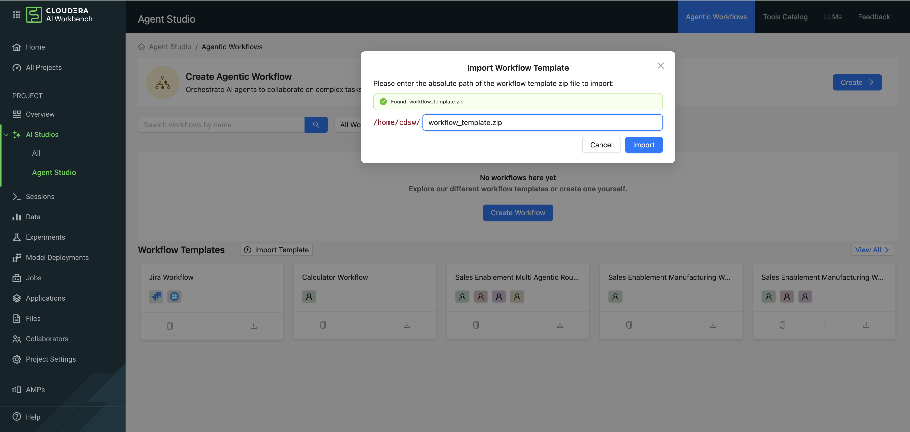
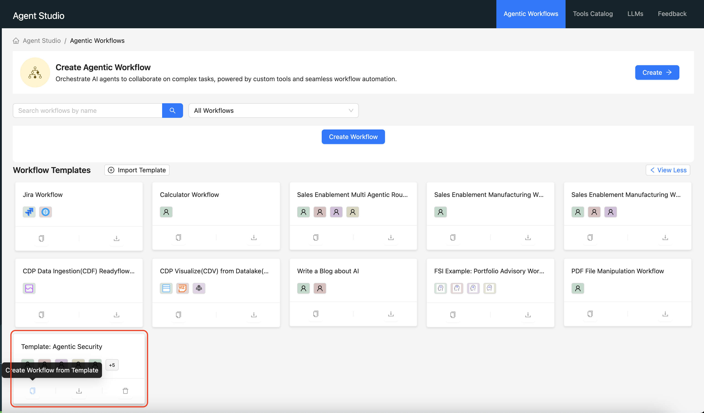
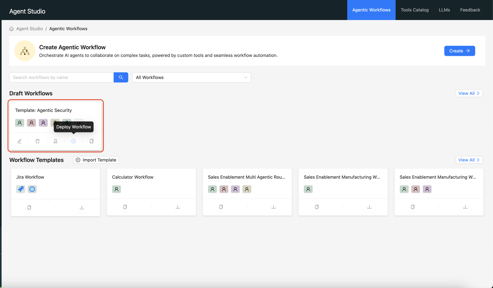

# Agentic Security Analysis AMP

A Cloudera Applied Machine Learning Prototype (AMP) by David Gabriel that deploys intelligent multi-agent systems to perform OWASP TOP 10 security analysis, documentation assessment, and test coverage evaluation on GitHub codebases.

IMPORTANT: Please read the following before proceeding. This AMP is optional software that you may use as a reference, for example, for creating your AI projects.  Cloudera makes the AMP available “as is,” without warrant or support of any kind, and Cloudera is not liable to you in any way for your use of the AMP.  This AMP also includes or otherwise depends on certain third party software packages. Information about such third party software packages are made available in the notice file associated with this AMP.   By configuring and launching this AMP, you will cause such third party software packages to be downloaded and installed into your environment, in some instances, from third parties' websites.  For each third party software package, please see the notice file and the applicable websites for more information, including the applicable license terms.  If you do not wish to download and install the third party software packages, do not configure, launch or otherwise use this AMP.  By configuring, launching or otherwise using the AMP, you acknowledge the foregoing statement and agree that Cloudera is not responsible or liable in any way for your use of the AMP and  the third party software packages.

## Overview

This AMP leverages agentic AI workflows to automatically analyze software repositories for security vulnerabilities, documentation gaps, and test coverage issues. The system employs specialized AI agents that work collaboratively through directed acyclic graph (DAG) workflows to provide actionable insights and remediation recommendations.

There are two ways to run this Agentic Workflow:

1. In a python notebook session, using _Agentic_AI.ipynb_ You must have access to a Cloudera AI Inference service or AWS bedrock to do this.

2. In Cloudera Agent Studio. See instructions below.

## Platform Compatibility

This workflow runs on:

- **Cloudera AI Inference** - Native integration with Cloudera Machine Learning platform
- **AWS Bedrock** - Using Claude models via AWS APIs

The system can also be deployed and managed through **Cloudera Agent Studio** for enhanced workflow orchestration and monitoring.

## Core Security Analysis Features

### OWASP Top 10 Detection Capabilities

The security analysis workflow automatically detects and analyzes vulnerabilities across all OWASP Top 10 categories:

## Agent Workflow Architecture

### Security Analysis DAG Flow

```
GitHub Repo
     |
     v
┌─────────────────────┐
│ CVE Detection Agent │ --> Identifies OWASP Top 10 vulnerabilities
└─────────────────────┘
     |
     v
┌─────────────────────┐
│Business Context Ag. │ --> Adds business impact assessment
└─────────────────────┘
     |
     v
┌─────────────────────┐
│ CVE Grading Agent   │ --> Assigns CVSS 3.1 severity scores
└─────────────────────┘
     |
     v
┌─────────────────────┐
│Attack Generator Ag. │ --> Creates exploitation scenarios
└─────────────────────┘
     |
     v
┌─────────────────────┐
│ Fix Generator Agent │ --> Provides remediation code
└─────────────────────┘
     |
     v
┌─────────────────────┐
│Integration Rep. Ag. │ --> Final reports & ticketing JSON
└─────────────────────┘
```

## Additional Workflows

### Documentation Enhancement

- **Code Architecture Analysis** - Identifies modules, APIs, and architectural patterns
- **Build Process Documentation** - Analyzes Makefiles, Dockerfiles, and deployment configurations
- **README Assessment** - Evaluates existing documentation against codebase reality
- **Improvement Recommendations** - Generates improved documentation templates

### Test Coverage Improvement

- **Coverage Gap Detection** - Identifies untested functions and critical code paths
- **Business Risk Assessment** - Evaluates the business impact of missing test coverage
- **Test Case Generation** - Creates specific, runnable test implementations
- **Integration-Ready Output** - Provides ticketing system integration for development teams

## Getting Started

### Prerequisites

- Cloudera Machine Learning environment OR AWS account with Bedrock access
- GitHub repository URL for analysis
- Python 3.11+ runtime environment

### Cloudera AI Workbench Notebook (Recommended)

The quickest way to run this AMP is through `Agentic_AI.ipynb`:

1. **Open the notebook** in your Cloudera ML workspace
2. **Set environment variables** for your chosen platform:
   - For AWS Bedrock: `AWS_PROFILE`, `AWS_REGION`
   - For CAII: `CDP_TOKEN` with your JWT token
3. **Configure the target repository** in the `demo_workflow()` function
4. **Run all cells** - the notebook will handle:
   - Repository cloning and processing
   - LLM client initialization
   - Security analysis execution
   - Result output

The notebook includes error handling and shows the complete workflow execution with progress indicators.

### Basic Usage

The workflow follows the same pattern demonstrated in `Agentic_AI.ipynb`:

#### Complete Security Analysis Workflow

```python
from agents import AgenticWorkflow
import yaml
import os

def demo_workflow():
    """Demonstrate the AgenticWorkflow system."""

    # Initialize the workflow system
    workflow = AgenticWorkflow()

    # Step 1: Clone and process the GitHub repository
    repo_url = "https://github.com/your-target/repository"
    print(f"Cloning repository: {repo_url}")

    try:
        # Initialize Git Repository Processor and process to markdown
        git_processor = workflow.GitRepoProcessor(repo_url)
        codebase_input_path = "data/inputs/codebase_files.md"
        git_processor.process_repository(codebase_input_path)

        print(f"Repository processed and saved to: {codebase_input_path}")

        # Clean up cloned repository directory
        git_processor.cleanup()

    except Exception as e:
        print(f"Error processing repository: {str(e)}")
        return

    # Step 2: Initialize LLM Client and run security analysis
    config_file_path = "sec_agents.yaml"  # or "docs_agents.yaml", "test_agents.yaml"

    if os.path.exists(config_file_path):
        # Initialize LLM Client (supports both Bedrock and CAII)
        llm_client = workflow.LLMClient(
            client_type="caii",  # or "bedrock"
            url="https://your-caii-endpoint.com/v1/",  # for CAII
            model_id="codestral",  # model to use
            max_tokens=64000  # adjust based on model context window
        )

        # Initialize the DAG constructor with truncation enabled for large inputs
        constructor = workflow.DAGConstructor(
            config_file_path,
            llm_client=llm_client,
            truncate_input=True  # Handle large codebases
        )

        # Build and execute the workflow
        dag_executor_function = constructor.build_executor()
        dag_executor_function()

    else:
        print(f"Configuration file {config_file_path} not found.")

# Run the analysis
demo_workflow()
```

#### Individual Workflow Components

**1. Repository Processing Only**

```python
from agents import AgenticWorkflow

# Clone and convert repository to markdown for analysis
workflow = AgenticWorkflow()
git_processor = workflow.GitRepoProcessor("https://github.com/user/repo")
git_processor.process_repository("data/inputs/codebase_files.md")
git_processor.cleanup()
```

**2. Security Analysis with Custom Configuration**

```python
# Run security analysis with specific model and settings
llm_client = AgenticWorkflow.LLMClient(
    client_type="bedrock",
    model_id="us.anthropic.claude-3-7-sonnet-20250219-v1:0",
    max_tokens=40000,
    region="us-west-2"
)

security_dag = AgenticWorkflow.DAGConstructor(
    "sec_agents.yaml",
    llm_client=llm_client,
    truncate_input=True
)

dag_executor = security_dag.build_executor()
dag_executor()
```

**3. Documentation or Test Coverage Analysis**

```python
# For documentation analysis
docs_dag = AgenticWorkflow.DAGConstructor("docs_agents.yaml")
docs_executor = docs_dag.build_executor()
docs_executor()

# For test coverage analysis
test_dag = AgenticWorkflow.DAGConstructor("test_agents.yaml")
test_executor = test_dag.build_executor()
test_executor()
```

#### Environment Configuration

**For AWS Bedrock:**

```bash
export AWS_PROFILE=your-profile
export AWS_REGION=us-west-2
```

**For Cloudera AI Inference:**

```bash
export CDP_TOKEN='{"token": "your-jwt-token", "expireAt": "2025-11-23T19:06:08.010000+00:00"}'
```

## Output Artifacts

- **Security Reports** - OWASP TOP 10 vulnerability analysis with CVSS scores
- **Attack Scenarios** - Detailed exploitation techniques and impact assessments
- **Remediation Code** - Ready-to-implement security fixes with before/after comparisons
- **Documentation Templates** - README and API documentation improvements
- **Test Cases** - Concrete, runnable test implementations for coverage gaps
- **Integration JSON** - Ticketing system payloads for development workflow integration

## Known Issues

- **Context Window Limitations** - Currently there is some friction in using this tool based on different sizes of context windows for different models. The example notebook use has a hard coded value 'max_tokens=40000'. This can be increased for faster performance if the context window of the model can support it. The code will chunk the initial input to match this value, which must be set correctly for the model being used.

## Running on Agent Studio

You can import the files from this AMP repository, directly into an Agent Studio.
To find out more about Agent Studio, refer to https://github.com/cloudera/CAI_STUDIO_AGENT
With just a few steps, this agentic security workflow can be replicated on Agent Studio.

1. Import workflow



2. Create workflow



3. Deploy Workflow



Important Note: Running this workflow requires an LLM

Refer to https://github.com/cloudera/CAI_STUDIO_AGENT/blob/main/docs/user_guide/models.md to configure the LLM for your Agent Studio

## Contributing

This AMP is designed to be extended and customized for specific organizational needs. Agent configurations can be modified through the YAML files, and new agents can be added to existing workflows.

### User Guide

This workflow processes the provided github repository by cloning it locally, extracting relevant files, then reading each one to identify security vulnerabilities in order to optimize context windows. The prompts and tasks for each agent have been customized to the inputs of the Studio, which can be easily configured using the interface.

## License

See LICENSE file for details.

## Authors

See CONTRIBUTORS.md
